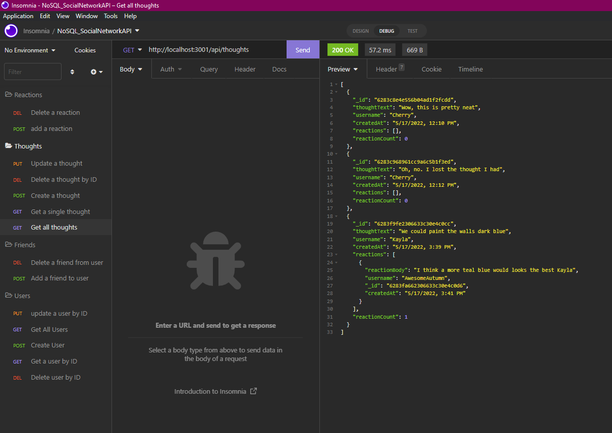

# NoSQL_SocialNetworkAPI

**Link to github repository:**
> https://github.com/autumnlf/HW09_README-Generator

**Link to walkthrough video:**
> https://drive.google.com/file/d/1YV79QxQDw8h6bw7ZGJS_kYNaF3kzl5NQ/view?usp=sharing

---

## Description
```
For this homework assignment we are tasked with using MongoDB to build an API for a social network
platform. The application should allow creation/deletion/updating of users, creation/deletion/updating 
of user thoughts, and creation/deletion of reactions to thoughts. Users will also have a friends list
where friends can be added/removed.
```

### Acceptance Criteria:
```
GIVEN a social network API
WHEN I enter the command to invoke the application
THEN my server is started and the Mongoose models are synced to the MongoDB database
WHEN I open API GET routes in Insomnia for users and thoughts
THEN the data for each of these routes is displayed in a formatted JSON
WHEN I test API POST, PUT, and DELETE routes in Insomnia
THEN I am able to successfully create, update, and delete users and thoughts in my database
WHEN I test API POST and DELETE routes in Insomnia
THEN I am able to successfully create and delete reactions to thoughts and add and remove friends to a user’s friend list
```

---

## Screenshots:
A view of using Insomnia to interact with API routes

* Showing all users:
    

* Showing all thoughts:
    

* Video walkthrough using Insomnia
    >https://drive.google.com/file/d/1YV79QxQDw8h6bw7ZGJS_kYNaF3kzl5NQ/view?usp=sharing